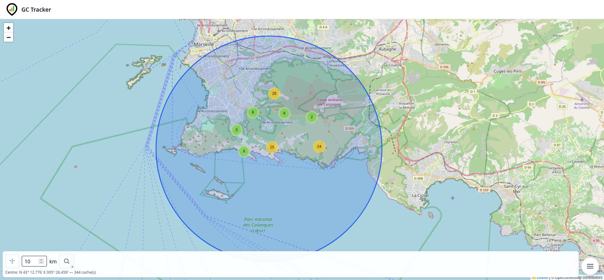
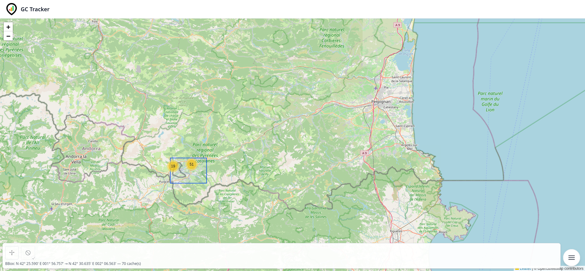
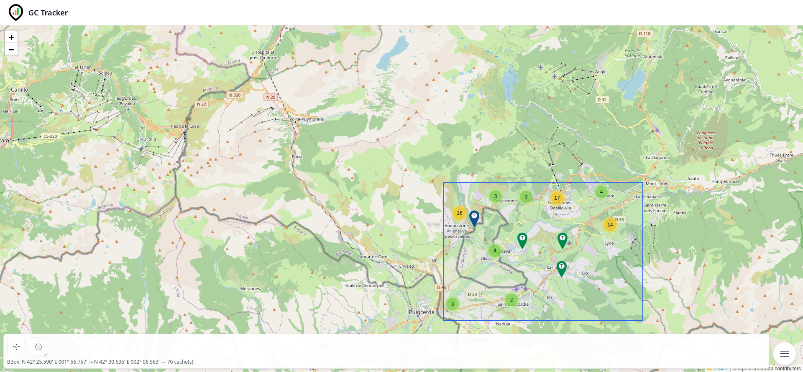
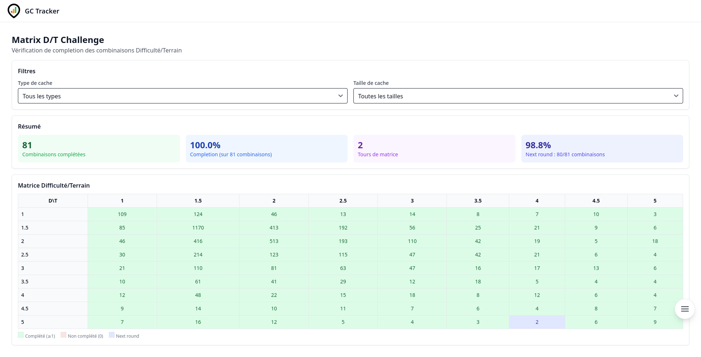
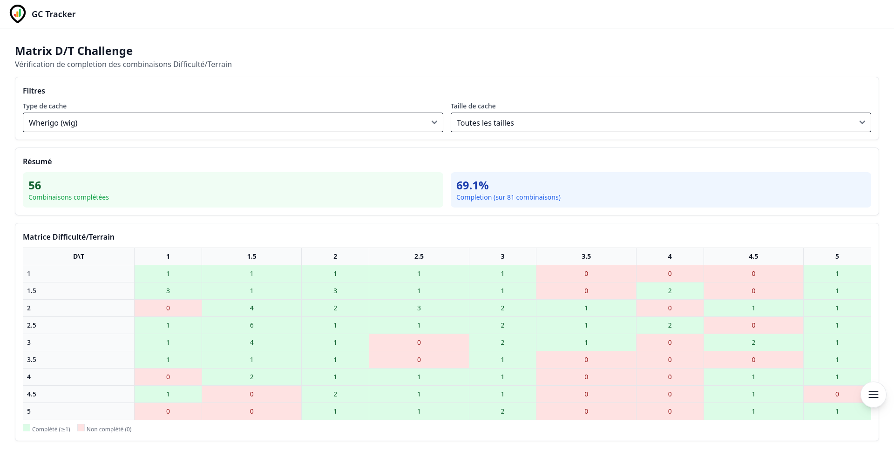
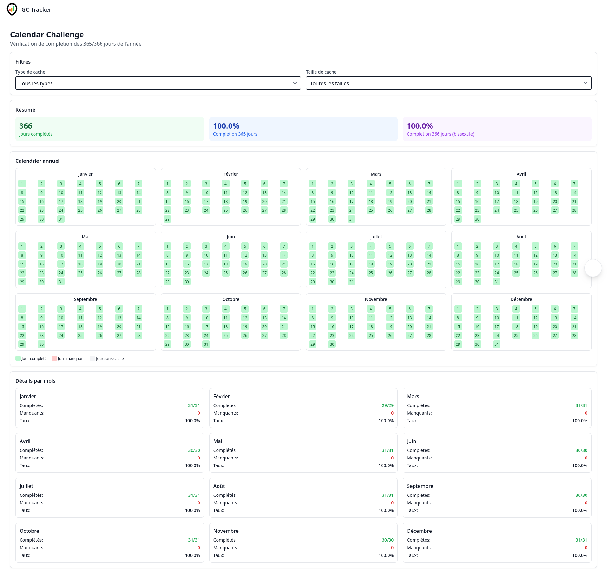
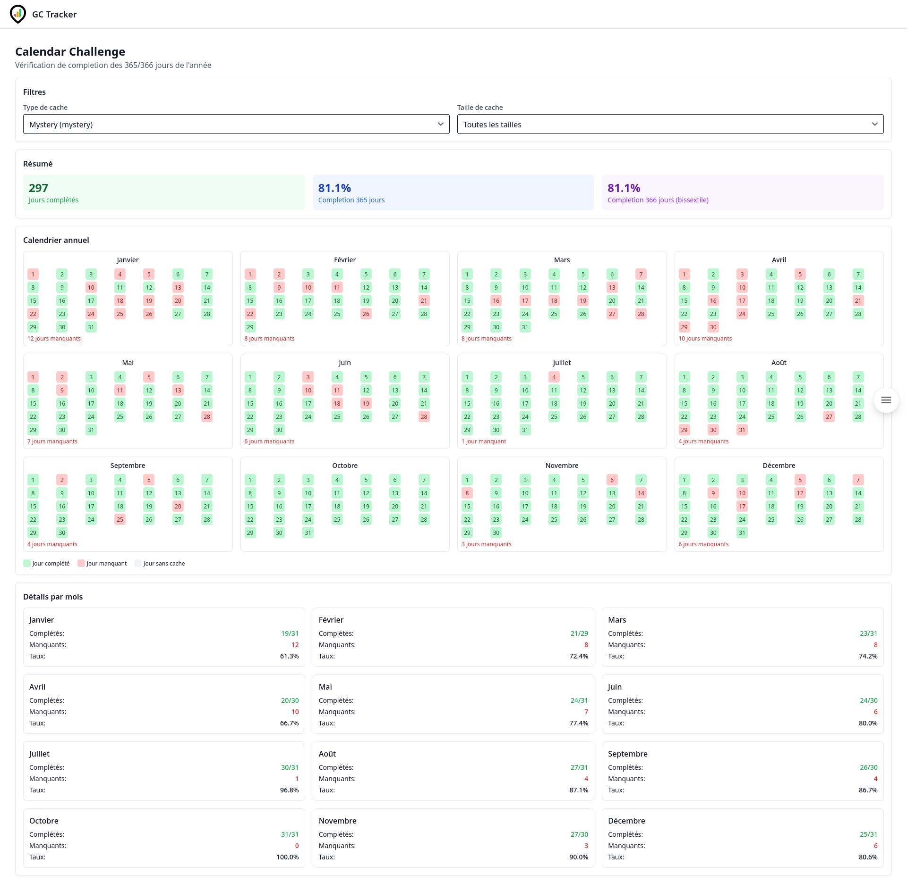

🇫🇷 Version française | [🇬🇧 English version](README.md)

---

# 🧭 GeoChallenge Tracker

> *Suivi de challenges de géocaching full-stack — API REST FastAPI + MongoDB, frontend Vue.js 3, import GPX, cartes interactives.*


[](https://github.com/MarvinLeRouge/GeoChallenge-Tracker/actions)
[](https://codecov.io/gh/MarvinLeRouge/GeoChallenge-Tracker)


## Concept

GeoChallenge Tracker est une application web complète conçue pour les passionnés de géocaching. Elle permet de suivre les challenges personnalisés, d'importer les trouvailles au format GPX, de visualiser la progression sur carte et d'obtenir des statistiques sur la complétion des défis.

L'application permet aux géocacheurs passionnés de :
- Définir et suivre leurs challenges personnalisés
- Importer leurs trouvailles au format GPX
- Visualiser leur avancement sur carte (OpenStreetMap)
- Obtenir des projections de complétion via des statistiques
- Suivre les challenges classiques comme la matrice D/T et le calendrier
- Identifier les caches cibles pour atteindre leurs objectifs

---

## 📸 Copes d'écran

### Recherche de caches

#### Par rayon
[](docs/screenshots/caches-radius.png)

#### Par Bbox
[](docs/screenshots/caches-bbox-1.png)

#### Par Bbox zoomée
[](docs/screenshots/caches-bbox-2.png)

### Challenges

#### Matrice non filtrée
[](docs/screenshots/matrix-any.png)

#### Matrice filtrée
[](docs/screenshots/matrix-wherigo.png)

#### Calendrier non filtrée
[](docs/screenshots/calendar-any.png)

#### Calendrier filtrée
[](docs/screenshots/calendar-mystery.png)

---

## 🧱 Technologies utilisées

### Backend
- **FastAPI** - Framework web Python moderne et rapide
- **MongoDB** - Base de données NoSQL pour le stockage des données
- **Motor** - Pilote asynchrone Python pour MongoDB
- **JWT** - Authentication par jetons web JSON
- **Pydantic** - Validation de données et gestion des paramètres
- **Python-Multipart** - Gestion du multipart form data pour les uploads
- **PassLib** - Hashage sécurisé des mots de passe
- **Bcrypt** - Algorithme de hashage pour les mots de passe

### Frontend
- **Vue.js 3** - Framework JavaScript pour les interfaces utilisateur
- **TypeScript** - Superset typé de JavaScript
- **Vue Router** - Routeur officiel pour Vue.js
- **Pinia** - Solution de gestion d'état pour Vue.js
- **Tailwind CSS** - Framework CSS utilitaire
- **Flowbite** - Composants UI open-source basés sur Tailwind
- **Flowbite Vue** - Composants Vue.js basés sur Flowbite
- **Leaflet** - Bibliothèque JavaScript pour les cartes interactives
- **Leaflet Draw** - Outils de dessin interactifs pour les cartes Leaflet
- **Heroicons Vue** - Icônes SVG élégantes
- **Lucide Vue** - Icônes SVG légères
- **Vite** - Environnement de développement rapide

### DevOps & Déploiement
- **Docker** - Plateforme de conteneurisation
- **Docker Compose** - Outil pour définir et exécuter des applications multi-conteneurs
- **Nginx** - Serveur web utilisé comme reverse proxy
- **MongoDB Atlas** - Service cloud MongoDB (externement hébergé)

### Tests
- **Pytest** - Framework de test pour Python (backend)
- **pytest-cov** - Rapport de couverture pour pytest
- **Codecov** - Suivi et rapport de couverture de code

---

## 🎯 Fonctionnalités

### Authentification & Gestion des utilisateurs
- Système d'inscription avec validation de mot de passe
- Authentification sécurisée avec JWT
- Vérification d'email avec codes de confirmation
- Renvoi d'email de vérification
- Gestion du profil utilisateur

### Gestion des caches
- Import de fichiers GPX/ZIP provenant de cgeo et Pocket Queries
- Recherche avancée de caches avec filtres multiples (type, difficulté, terrain, attributs, dates, etc.)
- Recherche géographique (dans une bounding box ou dans un rayon autour d'un point)
- Visualisation des caches sur carte interactive
- Récupération de caches par code GC ou par identifiant

### Système de challenges
- Synchronisation automatique des challenges utilisateurs
- Suivi de l'état des challenges (pending, accepted, dismissed, completed)
- Mise à jour par lot des challenges
- Détail des informations pour chaque challenge
- Évaluation et persistance des cibles pour les challenges

### Challenges classiques
- Vérification de la matrice D/T (9x9 combinaisons difficulté/terrain)
- Vérification du challenge calendrier (365/366 jours)
- Support des filtres par type et taille de cache
- Visualisation interactive des résultats

### Suivi de progression
- Évaluation en temps réel de la progression
- Historique des snapshots de progression
- Calcul automatique de la première progression pour les nouveaux challenges
- Visualisation de l'évolution de la progression

### Identification des cibles
- Évaluation et persistance des cibles pour chaque challenge
- Liste paginée des cibles avec tri possible
- Recherche des cibles à proximité d'un point
- Suppression des cibles pour un challenge spécifique

### Gestion des tâches de challenge
- Visualisation des tâches d'un challenge
- Remplacement de l'ensemble des tâches avec maintien de l'ordre
- Validation des tâches sans persistance

### Maintenance et outils
- Analyse et nettoyage des enregistrements orphelins
- Sauvegarde complète de la base de données
- Restauration depuis un fichier de sauvegarde
- Backfill des données d'altitude pour les caches (admin seulement)

---

## 📡 API Routes

### Authentification (`/auth`)
- `POST /auth/register` - Enregistrement d'un nouvel utilisateur
- `POST /auth/login` - Connexion d'un utilisateur
- `POST /auth/refresh` - Renouvellement du token d'accès
- `GET /auth/verify-email` - Vérification d'email par code
- `POST /auth/verify-email` - Vérification d'email via POST
- `POST /auth/resend-verification` - Renvoi du code de vérification

### Base (`/`)
- `GET /cache_types` - Récupération de tous les types de cache
- `GET /cache_sizes` - Récupération de toutes les tailles de cache
- `GET /ping` - Vérification de santé de l'API

### Caches (`/caches`)
- `POST /caches/upload-gpx` - Import de caches depuis fichier GPX/ZIP
- `POST /caches/by-filter` - Recherche de caches par filtres
- `GET /caches/within-bbox` - Caches dans une bounding box
- `GET /caches/within-radius` - Caches autour d'un point (rayon)
- `GET /caches/{gc}` - Récupération d'une cache par code GC
- `GET /caches/by-id/{id}` - Récupération d'une cache par identifiant MongoDB

### Challenges (`/challenges`)
- `POST /challenges/refresh-from-caches` - Recréation des challenges à partir des caches

### Mes challenges (`/my/challenges`)
- `POST /my/challenges/sync` - Synchronisation des UserChallenges manquants
- `GET /my/challenges` - Liste des UserChallenges
- `PATCH /my/challenges` - Patch en lot de plusieurs UserChallenges
- `GET /my/challenges/{uc_id}` - Détail d'un UserChallenge
- `PATCH /my/challenges/{uc_id}` - Modification d'un UserChallenge
- `GET /my/challenges/basics/calendar` - Vérification du challenge calendrier
- `GET /my/challenges/basics/matrix` - Vérification du challenge matrice D/T

### Mes tâches de challenge (`/my/challenges/{uc_id}/tasks`)
- `GET /my/challenges/{uc_id}/tasks` - Liste des tâches d'un UserChallenge
- `PUT /my/challenges/{uc_id}/tasks` - Remplacement des tâches d'un UserChallenge
- `POST /my/challenges/{uc_id}/tasks/validate` - Validation des tâches sans persistance

### Mon profil (`/my/profile`)
- `PUT /my/profile/location` - Enregistrement de la localisation
- `GET /my/profile/location` - Récupération de la localisation
- `GET /my/profile` - Récupération du profil utilisateur
- `GET /my/profile/stats` - Statistiques utilisateur (nb trouvailles, challenges, etc.)
- `POST /my/profile/found-caches/sync` - Synchronisation des trouvailles depuis un fichier texte/GPX/JSON

### Mes cibles (`/my`)
- `POST /my/challenges/{uc_id}/targets/evaluate` - Évaluation des cibles d'un UserChallenge
- `GET /my/challenges/{uc_id}/targets` - Liste des cibles d'un UserChallenge
- `GET /my/challenges/{uc_id}/targets/nearby` - Liste des cibles proches d'un UserChallenge
- `GET /my/targets` - Liste de toutes les cibles
- `GET /my/targets/nearby` - Liste des cibles proches de tous les challenges
- `DELETE /my/challenges/{uc_id}/targets` - Suppression des cibles d'un UserChallenge

### Mon avancement (`/my/challenges`)
- `GET /my/challenges/{uc_id}/progress` - Récupération du dernier snapshot et historique
- `POST /my/challenges/{uc_id}/progress/evaluate` - Évaluation et sauvegarde d'un snapshot
- `POST /my/challenges/new/progress` - Évaluation de la première progression

### Élévation des caches (`/caches_elevation`)
- `POST /caches_elevation/caches/elevation/backfill` - Backfill de l'altitude manquante (admin)

### Maintenance (`/maintenance`) — réservé admin
- `GET /maintenance/db_cleanup` - Analyse de la base de données pour orphelins
- `DELETE /maintenance/db_cleanup` - Exécution du nettoyage des orphelins
- `GET /maintenance/db_cleanup/backups` - Liste des sauvegardes de nettoyage
- `GET /maintenance/backups/{filepath:path}` - Téléchargement d'un fichier de sauvegarde
- `POST /maintenance/db_full_backup` - Création d'une sauvegarde complète
- `POST /maintenance/db_full_restore/{filename}` - Restauration depuis une sauvegarde
- `GET /maintenance/db_backups` - Liste de tous les fichiers de sauvegarde
- `POST /maintenance/upload-gpx` - Réimport des attributs des caches à partir d'un fichier GPX
- `GET /maintenance/users/{user_id}/stats` - Statistiques d'un utilisateur spécifique
- `POST /maintenance/users/{user_id}/found-caches/sync` - Synchronisation des trouvailles d'un utilisateur

---

## 🐳 Installation & Lancement

> MongoDB **doit être accessible depuis l’extérieur** (par ex : MongoDB Atlas)

### 📁 Pré-requis
- Docker & Docker Compose installés
- Node.js (pour développement frontend)
- Un fichier `.env` ou une variable d'environnement `MONGO_URI` disponible

### ▶️ Lancement en mode développement

```bash
# Construire et lancer les services
docker compose up --build

# Le frontend est accessible à http://localhost:5173
# Le backend est accessible à http://localhost:8000
```

### 🔧 Configuration

Créez un fichier `.env` à la racine du projet avec les variables suivantes :

```env
# Backend
MONGO_URI=your_mongodb_connection_string
JWT_SECRET_KEY=your_secret_key
JWT_ALGORITHM=HS256
JWT_ACCESS_TOKEN_EXPIRE_MINUTES=30
JWT_REFRESH_TOKEN_EXPIRE_MINUTES=43200

# Frontend (dans frontend/.env)
VITE_API_URL=http://localhost:8000/api
```

### 🧪 Lancement des tests

```bash
# Backend tests
cd backend
pip install -r requirements.txt -r requirements-dev.txt
pytest tests/unit/ --cov=app --cov-report=term-missing -q
```

---

## 🔨 Build & Déploiement

### Build avec date de commit

Le script `build.sh` met à jour automatiquement la date de build dans `.env` en utilisant la date du dernier commit Git.

```bash
# Mettre à jour BUILD_DATE et rebuilder l'image backend
./build.sh

# Puis lancer l'application
docker-compose up
```

**Note** : La date de build est affichée dans l'endpoint `/version` :

```bash
curl http://localhost:8000/version

# Réponse :
{
  "version": "0.1.0",
  "environment": "development",
  "build_date": "2026-02-27T18:42:15+01:00"
}
```

### Workflow recommandé

1. Développer et tester vos modifications
2. Committer vos changements
3. Lancer `./build.sh` pour mettre à jour la build date
4. Tester l'application
5. Push sur GitHub

---

## 🤝 Contribution

Les contributions sont les bienvenues ! Voici comment vous pouvez contribuer :

1. Fork du projet
2. Création d'une branche pour votre fonctionnalité (`git checkout -b feature/AmazingFeature`)
3. Commit de vos changements (`git commit -m 'Add some AmazingFeature'`)
4. Push vers la branche (`git push origin feature/AmazingFeature`)
5. Ouverture d'une Pull Request

### Convention de nommage des branches
- Fonctionnalités : `feat/description-courte`
- Corrections : `fix/description-courte`
- Chores / CI : `chore/description-courte`
- Documentation : `docs/description-courte`
- Tests : `test/description-courte`

---

## 📋 Licence

Ce projet est sous licence MIT - voir le fichier [LICENSE](LICENSE) pour plus de détails.
