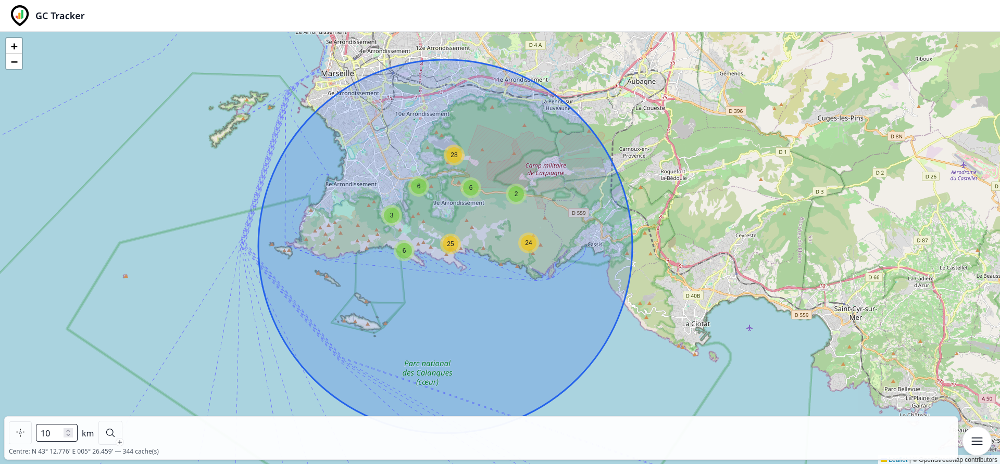
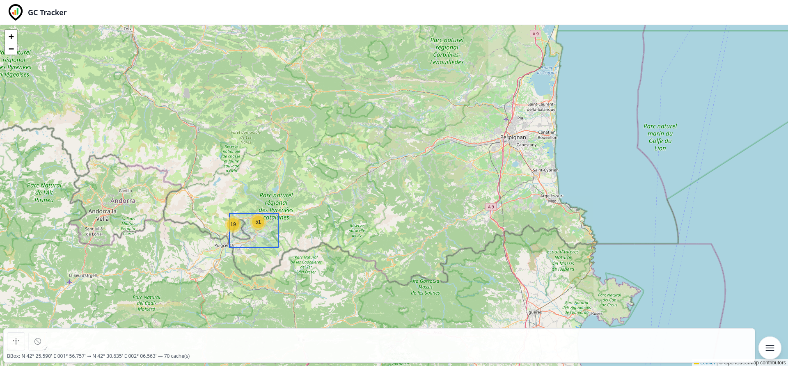
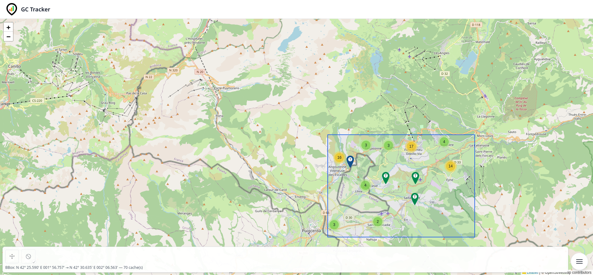
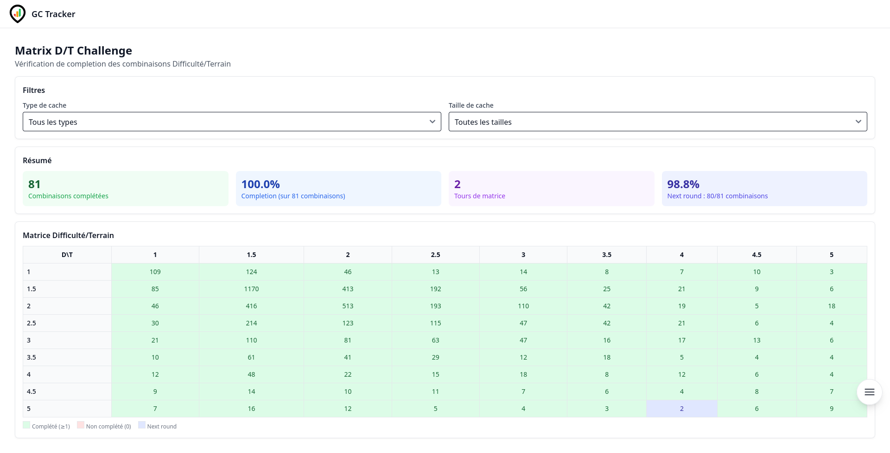
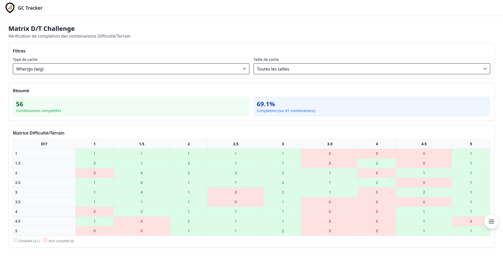
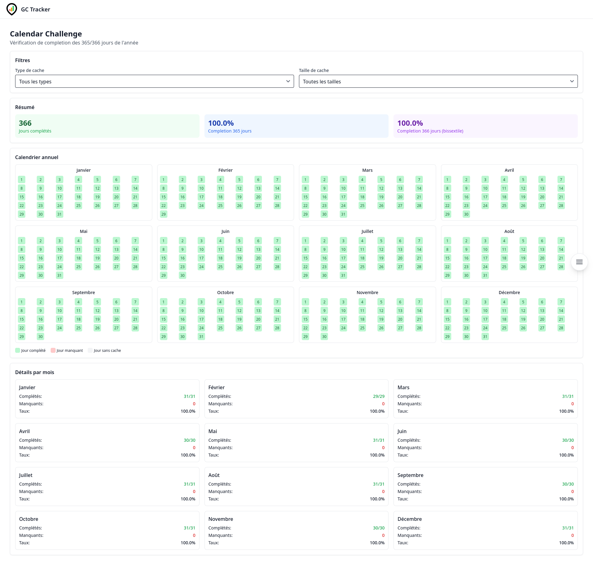
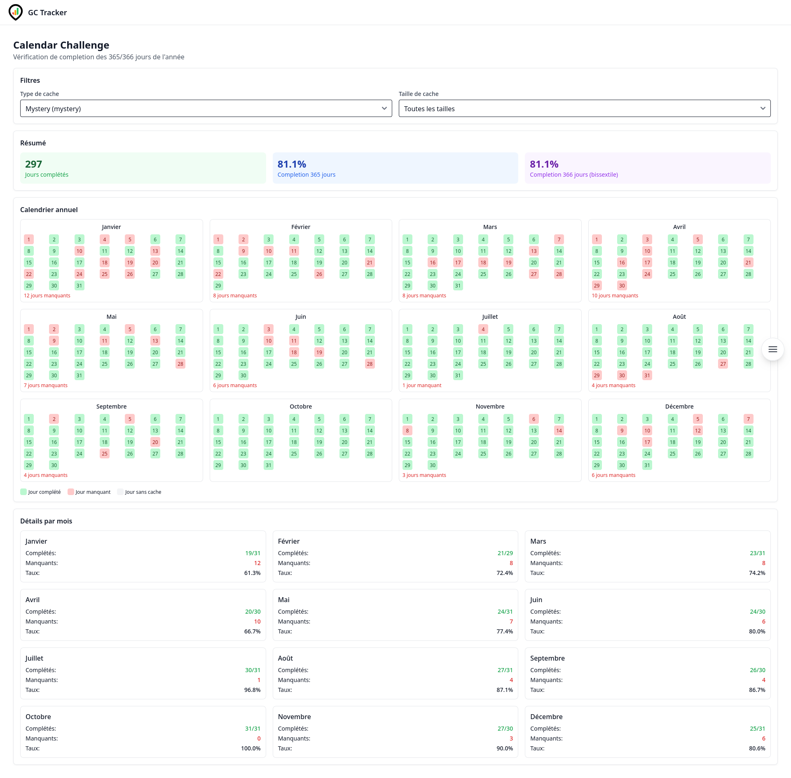

[🇫🇷 Version française](README.fr.md) | 🇬🇧 English version

---

# 🧭 GeoChallenge Tracker

> *Full-stack geocaching challenge tracker — FastAPI + MongoDB REST API, Vue.js 3 frontend, GPX import, interactive maps.*


[](https://github.com/MarvinLeRouge/GeoChallenge-Tracker/actions)
[](https://codecov.io/gh/MarvinLeRouge/GeoChallenge-Tracker)


## Concept

GeoChallenge Tracker is a comprehensive web application designed for geocaching enthusiasts. It allows tracking custom challenges, importing finds from GPX files, visualizing progress on maps, and getting completion statistics for challenges.

The application enables passionate geocachers to:
- Define and track their custom challenges
- Import their finds in GPX format
- Visualize their progress on maps (OpenStreetMap)
- Get completion projections through statistics
- Track classic challenges such as the D/T matrix and calendar challenges
- Identify target caches to reach their goals

---

## 📸 Screenshots

### Caches search

#### By radius
[](docs/screenshots/caches-radius.png)

#### By Bbox
[](docs/screenshots/caches-bbox-1.png)

#### By Bbox zoomed
[](docs/screenshots/caches-bbox-2.png)

### Challenges

#### Matrix unfiltered
[](docs/screenshots/matrix-any.png)

#### Matrix filtered
[](docs/screenshots/matrix-wherigo.png)

#### Calendar unfiltered
[](docs/screenshots/calendar-any.png)

#### Calendar filtered
[](docs/screenshots/calendar-mystery.png)

---

## 🧱 Technologies Used

### Backend
- **FastAPI** - Modern, fast Python web framework
- **MongoDB** - NoSQL database for data storage
- **Motor** - Asynchronous Python driver for MongoDB
- **JWT** - JSON Web Token authentication
- **Pydantic** - Data validation and configuration management
- **Python-Multipart** - Multipart form data handling for uploads
- **PassLib** - Secure password hashing
- **Bcrypt** - Password hashing algorithm

### Frontend
- **Vue.js 3** - JavaScript framework for user interfaces
- **TypeScript** - Typed superset of JavaScript
- **Vue Router** - Official router for Vue.js
- **Pinia** - State management solution for Vue.js
- **Tailwind CSS** - Utility-first CSS framework
- **Flowbite** - Open-source UI components based on Tailwind
- **Flowbite Vue** - Vue.js components based on Flowbite
- **Leaflet** - JavaScript library for interactive maps
- **Leaflet Draw** - Interactive drawing tools for Leaflet maps
- **Heroicons Vue** - Elegant SVG icons
- **Lucide Vue** - Lightweight SVG icons
- **Vite** - Development environment

### DevOps & Deployment
- **Docker** - Containerization platform
- **Docker Compose** - Tool to define and run multi-container applications
- **Nginx** - Web server used as reverse proxy
- **MongoDB Atlas** - Cloud MongoDB service (externally hosted)

### Testing
- **Pytest** - Testing framework for Python (backend)
- **pytest-cov** - Coverage reporting for pytest
- **Codecov** - Coverage tracking and reporting

---

## 🎯 Features

### Authentication & User Management
- Registration system with password validation
- Secure JWT-based authentication
- Email verification with confirmation codes
- Resend verification email
- User profile management

### Cache Management
- Import GPX/ZIP files from cgeo and Pocket Queries
- Advanced cache search with multiple filters (type, difficulty, terrain, attributes, dates, etc.)
- Geographic search (within bounding box or radius around a point)
- Visualization of caches on interactive map
- Retrieval of caches by GC code or by identifier
- **Choropleth map** — found caches per administrative zone (regions → departments drill-down)
- **Per-type breakdown map** — choropleth map where clicking a zone shows found-cache counts broken down by all 13 cache types (including zeros), in a fixed canonical order

### Challenge System
- Automatic synchronization of user challenges
- Tracking of challenge status (pending, accepted, dismissed, completed)
- Bulk update of challenges
- Detailed information for each challenge
- Evaluation and persistence of targets for challenges

### Classic Challenges
- D/T matrix verification (9x9 difficulty/terrain combinations)
- Calendar challenge verification (365/366 days)
- Support for type and size filters
- Interactive visualization of results

### Progress Tracking
- Real-time evaluation of progress
- History of progress snapshots
- Automatic calculation of first progress for new challenges
- Visualization of progress evolution

### Target Identification
- Evaluation and persistence of targets for each challenge
- Paginated list of targets with sorting options
- Search for targets near a specific point
- Deletion of targets for a specific challenge

### Challenge Task Management
- Visualization of tasks for a challenge
- Replacement of all tasks while preserving order
- Validation of tasks without persistence

### Maintenance and Tools
- Analysis and cleanup of orphaned records
- Full database backup
- Restore from backup file
- Backfill of elevation data for caches (admin only)

---

## 📡 API Routes

### Authentication (`/auth`)
- `POST /auth/register` - Register a new user
- `POST /auth/login` - Login a user
- `POST /auth/refresh` - Refresh access token
- `GET /auth/verify-email` - Verify email by code
- `POST /auth/verify-email` - Verify email via POST
- `POST /auth/resend-verification` - Resend verification code

### Base (`/`)
- `GET /cache_types` - Retrieve all cache types
- `GET /cache_sizes` - Retrieve all cache sizes
- `GET /ping` - API health check

### Caches (`/caches`)
- `POST /caches/upload-gpx` - Import caches from GPX/ZIP file
- `POST /caches/by-filter` - Search caches by filters
- `GET /caches/within-bbox` - Caches within bounding box
- `GET /caches/within-radius` - Caches around a point (radius)
- `GET /caches/{gc}` - Retrieve a cache by GC code
- `GET /caches/by-id/{id}` - Retrieve a cache by MongoDB identifier

### Administrative zones (`/zones`, `/geo`)
- `GET /zones?country=FR&level=1` - Zones with found-cache counts for the current user
- `GET /zones/{code}?level=1` - Zone detail with count and top 10 found caches
- `GET /zones/{code}/type-stats?level=1` - Per-type found-cache counts for a zone (all 13 types, zeros included)
- `GET /geo/FR/regions.geojson` - GeoJSON FeatureCollection of French regions
- `GET /geo/FR/departements.geojson` - GeoJSON FeatureCollection of French departments

### Challenges (`/challenges`)
- `POST /challenges/refresh-from-caches` - Recreate challenges from caches

### My challenges (`/my/challenges`)
- `POST /my/challenges/sync` - Synchronize missing UserChallenges
- `GET /my/challenges` - List UserChallenges
- `PATCH /my/challenges` - Bulk update multiple UserChallenges
- `GET /my/challenges/{uc_id}` - Detail of a UserChallenge
- `PATCH /my/challenges/{uc_id}` - Update a UserChallenge
- `GET /my/challenges/basics/calendar` - Calendar challenge verification
- `GET /my/challenges/basics/matrix` - D/T matrix challenge verification

### My challenge tasks (`/my/challenges/{uc_id}/tasks`)
- `GET /my/challenges/{uc_id}/tasks` - List tasks of a UserChallenge
- `PUT /my/challenges/{uc_id}/tasks` - Replace tasks of a UserChallenge
- `POST /my/challenges/{uc_id}/tasks/validate` - Validate tasks without persistence

### My profile (`/my/profile`)
- `PUT /my/profile/location` - Set location
- `GET /my/profile/location` - Get location
- `GET /my/profile` - Get user profile
- `GET /my/profile/stats` - Get user statistics (found count, challenge count, etc.)
- `POST /my/profile/found-caches/sync` - Sync found caches from a text/GPX/JSON file

### My targets (`/my`)
- `POST /my/challenges/{uc_id}/targets/evaluate` - Evaluate targets for a UserChallenge
- `GET /my/challenges/{uc_id}/targets` - List targets for a UserChallenge
- `GET /my/challenges/{uc_id}/targets/nearby` - List nearby targets for a UserChallenge
- `GET /my/targets` - List of all targets
- `GET /my/targets/nearby` - List nearby targets for all challenges
- `DELETE /my/challenges/{uc_id}/targets` - Delete targets for a UserChallenge

### My progress (`/my/challenges`)
- `GET /my/challenges/{uc_id}/progress` - Retrieve latest snapshot and history
- `POST /my/challenges/{uc_id}/progress/evaluate` - Evaluate and save snapshot
- `POST /my/challenges/new/progress` - Evaluate first progress

### Cache elevation (`/caches_elevation`)
- `POST /caches_elevation/caches/elevation/backfill` - Backfill missing elevation (admin)

### Maintenance (`/maintenance`) — admin only
- `GET /maintenance/db_cleanup` - Analyze database for orphans
- `DELETE /maintenance/db_cleanup` - Execute orphan cleanup
- `GET /maintenance/db_cleanup/backups` - List cleanup backup files
- `GET /maintenance/backups/{filepath:path}` - Download backup file
- `POST /maintenance/db_full_backup` - Create full backup
- `POST /maintenance/db_full_restore/{filename}` - Restore from backup
- `GET /maintenance/db_backups` - List all backup files
- `POST /maintenance/upload-gpx` - Re-import cache attributes from a GPX file
- `GET /maintenance/users/{user_id}/stats` - Get stats for a specific user
- `POST /maintenance/users/{user_id}/found-caches/sync` - Sync found caches for a specific user

---

## 🐳 Installation & Launch

> MongoDB **must be accessible from the outside** (e.g., MongoDB Atlas)

### 📁 Prerequisites
- Docker & Docker Compose installed
- Node.js (for frontend development)
- A `.env` file or `MONGO_URI` environment variable available

### ▶️ Development mode launch

```bash
# Build and launch services
docker compose up --build

# Frontend is accessible at http://localhost:5173
# Backend is accessible at http://localhost:8000
```

### 🔧 Configuration

Create a `.env` file at the project root with the following variables:

```env
# Backend
MONGO_URI=your_mongodb_connection_string
JWT_SECRET_KEY=your_secret_key
JWT_ALGORITHM=HS256
JWT_ACCESS_TOKEN_EXPIRE_MINUTES=30
JWT_REFRESH_TOKEN_EXPIRE_MINUTES=43200

# Frontend (in frontend/.env)
VITE_API_URL=http://localhost:8000/api
```

### 🧪 Running tests

```bash
# Backend tests
cd backend
pip install -r requirements.txt -r requirements-dev.txt
pytest tests/unit/ --cov=app --cov-report=term-missing -q
```

---

## 🔨 Build & Deployment

### Build with commit date

The `build.sh` script automatically updates the build date in `.env` using the last Git commit date.

```bash
# Update BUILD_DATE and rebuild backend image
./build.sh

# Then start the application
docker-compose up
```

**Note**: The build date is displayed in the `/version` endpoint:

```bash
curl http://localhost:8000/version

# Response:
{
  "version": "0.1.0",
  "environment": "development",
  "build_date": "2026-02-27T18:42:15+01:00"
}
```

### Recommended workflow

1. Develop and test your changes
2. Commit your changes
3. Run `./build.sh` to update the build date
4. Test the application
5. Push to GitHub

---

## 🗺️ Roadmap

Priority synthesis from the full roadmap (see [`docs/roadmap.md`](docs/roadmap.md) for details, context, and implementation notes per item).

### 🔴 Critical
- Password reset flow (no `/auth/forgot-password` / `/auth/reset-password` routes exist yet)
- Asynchronous GPX import (Celery + Redis, current import is synchronous and can time out on large files)
- Progress page (frontend) — API ready, page still a placeholder
- Targets page (frontend) — API ready, page still a placeholder
- Backend API tests (routes themselves are not tested end-to-end)
- Structured logging (replace `print()` calls, add request correlation IDs)
- Dev/prod environment separation (single `.env` used for both today)
- HTTPS in production (certificate renewal and HSTS not documented/verified)

### 🟠 High
- GPX validation before full in-memory processing
- Cache search by filter (frontend) — API ready, page still a placeholder
- "Challenge completed" email notification
- Challenge GPX export
- Backend test coverage ≥ 60% enforced in CI
- Frontend tests (Vitest business logic, component tests)
- Docker Compose healthchecks
- CI/CD: run tests automatically before merge

### 🟡 Normal
- Finalize UserChallenges synchronization logic (full vs. delta)
- Validate bulk PATCH challenges behavior
- Streaming support for large GPX files
- Automatic progress evaluation after a successful import
- Map marker clustering
- Dedicated map view for challenge targets
- Real SMTP connectivity check in `/health`
- Advanced user statistics (evolution charts, milestone projections)
- Full-text cache search
- Challenge integration tests
- Automate `BUILD_DATE` injection in CI

### 🟢 Nice-to-have
- Server-side refresh token invalidation on logout
- Achievable challenge suggestions
- Finds heatmap
- In-app notifications
- Prometheus metrics
- Centralized production logs

---

## ✅ Recently completed

### 🔒 Security hardening

Full OWASP Top 10:2025 / ASVS 5.0 audit pass, all findings resolved (4 critical, 7 medium, 4 minor) - see `git log` for the individual PRs.

- ✅ **Critical** - Rate limiting / brute-force protection on `/auth/login`, `/auth/register`, `/auth/resend-verification`
- ✅ **Critical** - Refresh token revocation (no logout endpoint invalidates the 7-day refresh token server-side)
- ✅ **Critical** - Dependency vulnerability scanning in CI (`pip-audit` / `npm audit`)
- ✅ **Critical** - `now()` returned naive local time instead of UTC, mistreated as UTC by JWT encoding
- ✅ Verification code sent via a GET query param ends up in access logs and can leak via the `Referer` header
- ✅ Missing security headers (Content-Security-Policy, HSTS, Referrer-Policy, Permissions-Policy)
- ✅ No cap on cumulative decompressed size for ZIP/GPX import (zip-bomb risk)
- ✅ Email verification codes stored in plaintext in the database
- ✅ No security event logging for failed login attempts
- ✅ A malformed JWT `sub` claim triggers a generic 500 instead of a clean 401
- ✅ `MaxBodySizeMiddleware` is bypassable via chunked transfer-encoding
- ✅ Access token TTL was hardcoded instead of following the configured `jwt_expiration_minutes`
- ✅ Password hashing used bcrypt only; migrated to argon2id, with transparent re-hashing of legacy accounts on login
- ✅ `cleanup_old_logs` used `print()` instead of the configured logger
- ✅ A destructive full-database restore (`drop_existing=True`) needed nothing beyond a valid admin JWT (single-use confirmation key, same pattern as `db_cleanup`)

---

## 🚧 Ongoing analysis (not yet implemented)

The following work streams have been analyzed and broken down into concrete tasks, but no code has been changed yet.

### 📧 Email delivery migration (Brevo)
- Verify what `SMTP_HOST` actually resolves to in production (may still point to a leftover `mailhog` test catcher instead of a real relay)
- Decide whether to reuse an existing Brevo account or create a dedicated one; verify the sender domain (SPF/DKIM/DMARC)
- Add Brevo SMTP variables (`smtp-relay.brevo.com`, port, credentials) to the production environment
- Remove the `mailhog` service from `docker-compose.prod.yml`
- Confirm the sender address matches a verified Brevo domain
- Send a real test email in production to confirm delivery

### 🎨 Frontend design audit
- **Critical** — the `dark_mode` user preference is stored in the backend but never implemented in the frontend (no `dark:` classes anywhere)
- Calendar day details are only visible on hover (`title` attribute) — invisible on mobile/touch, weak for screen readers
- Multi-color stat tiles (green/blue/purple/indigo) without a consistent color meaning
- Repeated identical card wrappers across sections with no visual hierarchy between them
- Leftover debug `console.log` calls in production code
- Inconsistent loading feedback (spinner vs. plain text) between pages

---

## 🤝 Contribution

Contributions are welcome! Here's how you can contribute:

1. Fork the project
2. Create a branch for your feature (`git checkout -b feature/AmazingFeature`)
3. Commit your changes (`git commit -m 'Add some AmazingFeature'`)
4. Push to the branch (`git push origin feature/AmazingFeature`)
5. Open a Pull Request

### Branch naming convention
- Features: `feat/short-description`
- Fixes: `fix/short-description`
- Chores / CI: `chore/short-description`
- Documentation: `docs/short-description`
- Tests: `test/short-description`

---

## 📋 License

This project is licensed under the MIT License - see the [LICENSE](LICENSE) file for details.
